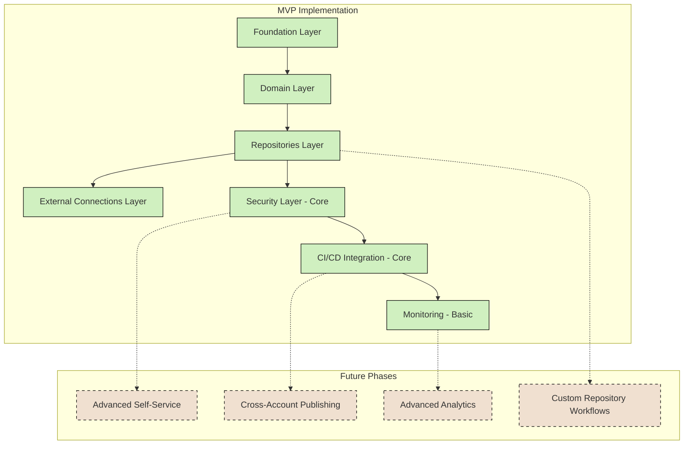
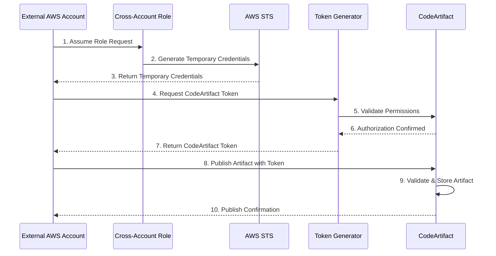

# AWS CodeArtifact Migration: Terraform & Terragrunt Architecture

## MVP Implementation Scope

For the Minimum Viable Product (MVP) implementation, we'll focus on core functionality while ensuring production-grade reliability for essential features. The MVP will enable all critical artifact management capabilities while deferring some advanced self-service and cross-organization features to future phases.



## Use Case to Module and Terragrunt Layer Mapping with AWS Resources

| Use Case ID | Use Case Description | Required Terraform Modules | Terragrunt Layer | AWS Resources Created | Implementation Details | MVP Status |
|-------------|----------------------|---------------------------|------------------|---------------------|------------------------|-----------|
| UC-1 | **Self-service artifact publishing** - Developers need to publish new packages without administrative intervention | • terraform-aws-codeartifact-security<br>• terraform-aws-codeartifact-cicd | • security<br>• cicd | • IAM Roles & Policies<br>• Lambda for token generation<br>• CodeArtifact Repository Permissions<br>• EventBridge Rules | • IAM roles with predefined permission boundaries for developer self-service<br>• Time-limited token generation APIs<br>• Repository-specific publish policies<br>• Developer-focused authentication helpers | **MVP - Core publishing** ✅<br>Advanced self-service: Future |
| UC-2 | **Dependency resolution from public repositories** - Teams need access to public dependencies (Maven Central, npm, etc.) | • terraform-aws-codeartifact-repositories<br>• terraform-aws-codeartifact-connections | • repositories<br>• external-connections | • CodeArtifact Repositories (proxy type)<br>• CodeArtifact External Connections<br>• CloudWatch Alarms for connection health | • Proxy repository configurations with caching<br>• Connection health monitoring<br>• Rate limiting configuration<br>• Team-specific proxy repositories when needed | **MVP** ✅ |
| UC-3 | **Organization-wide artifact sharing** - Teams need to consume artifacts from other internal teams | • terraform-aws-codeartifact-domain<br>• terraform-aws-codeartifact-repositories<br>• terraform-aws-codeartifact-security | • domain<br>• repositories<br>• security | • CodeArtifact Domain<br>• CodeArtifact Repositories (group type)<br>• IAM Read Policies<br>• Resource Policies | • Group repositories to aggregate team artifacts<br>• Cross-team IAM read permissions<br>• Domain-level asset deduplication<br>• Repository upstreaming between teams | **MVP** ✅ |
| UC-4 | **Secure artifact promotion** - Artifacts need to be promoted between environments (dev→staging→prod) | • terraform-aws-codeartifact-repositories<br>• terraform-aws-codeartifact-security<br>• terraform-aws-codeartifact-cicd | • dev/repositories<br>• staging/repositories<br>• prod/repositories<br>• security<br>• cicd | • IAM Promotion Roles<br>• Lambda Functions for promotion<br>• Step Functions Workflow<br>• DynamoDB for workflow state<br>• CodeArtifact Resource Policies | • Cross-environment copy permissions<br>• Immutable version enforcement<br>• Promotion approval workflows<br>• Environment-specific access boundaries | **MVP - Basic promotion** ✅<br>Advanced workflows: Future |
| UC-5 | **Legacy artifact migration** - Existing artifacts in Nexus need to be migrated to CodeArtifact | • terraform-aws-codeartifact-foundation<br>• terraform-aws-codeartifact-repositories | • foundation<br>• repositories | • S3 Buckets for migration staging<br>• Lambda Functions for migration<br>• CloudWatch Logs<br>• CloudWatch Dashboard<br>• Step Functions for workflow | • S3 intermediate storage configuration<br>• Bulk migration tools integration<br>• Artifact integrity verification<br>• Migration reporting and status tracking | **MVP** ✅ |
| UC-6 | **Artifact retention and cleanup** - Old/unused artifacts need to be archived or removed | • terraform-aws-codeartifact-repositories<br>• terraform-aws-codeartifact-monitoring | • repositories<br>• monitoring | • EventBridge Rules<br>• Lambda Functions<br>• S3 Archive Buckets<br>• CloudWatch Metrics<br>• SNS Topics | • Repository-specific retention policies<br>• Usage tracking and reporting<br>• Scheduled cleanup jobs<br>• Archival process for compliance | **MVP - Basic retention** ✅<br>Advanced lifecycle: Future |
| UC-7 | **Build tool integration** - Various build tools (Maven, Gradle, npm) need to authenticate and use repositories | • terraform-aws-codeartifact-security<br>• terraform-aws-codeartifact-cicd | • security<br>• cicd | • IAM Roles for CI/CD<br>• Lambda for token generation<br>• SSM Parameters for configs<br>• CodeBuild build spec templates | • Build-tool specific authentication helpers<br>• Configuration templates for common tools<br>• Token management integration<br>• IDE plugin support | **MVP - Core tools** ✅<br>Advanced IDE integration: Future |
| UC-8 | **Access auditing and compliance** - Security teams need visibility into who accessed what artifacts | • terraform-aws-codeartifact-security<br>• terraform-aws-codeartifact-monitoring | • security<br>• monitoring | • CloudTrail Configurations<br>• CloudWatch Logs<br>• Athena Queries<br>• QuickSight Dashboards<br>• S3 Log Archives | • Comprehensive CloudTrail integration<br>• Access reporting dashboards<br>• Anomaly detection alerting<br>• Audit log retention configuration | **MVP - Basic auditing** ✅<br>Advanced compliance: Future |
| UC-9 | **Repository performance monitoring** - Operations teams need visibility into system performance | • terraform-aws-codeartifact-monitoring | • monitoring | • CloudWatch Dashboards<br>• CloudWatch Alarms<br>• SNS Topics<br>• Lambda Functions<br>• EventBridge Rules | • CloudWatch dashboard configurations<br>• Performance metric collection<br>• Latency and error rate alerting<br>• Team-specific view filtering | **MVP - Essential metrics** ✅<br>Advanced analytics: Future |
| UC-10 | **Self-service repository creation** - Teams need to create new repositories for new projects | • terraform-aws-codeartifact-repositories<br>• terraform-aws-codeartifact-security | • repositories<br>• security | • API Gateway<br>• Lambda Functions<br>• DynamoDB for approvals<br>• Step Functions<br>• IAM Roles & Policies | • Repository template definitions<br>• Self-service API integration<br>• Approval workflow configuration<br>• Repository provisioning limits | Future Phase |
| UC-11 | **Cross-account publishing** - Other AWS accounts need to publish artifacts to central repository | • terraform-aws-codeartifact-security<br>• terraform-aws-codeartifact-domain | • security<br>• domain | • IAM Roles with cross-account trust<br>• Resource Policies<br>• STS AssumeRole configurations<br>• CloudTrail for cross-account activity | • Cross-account IAM role setup<br>• Repository policies allowing external accounts<br>• Token management for external accounts<br>• Cross-account audit logging | Future Phase |

## AWS CodeArtifact Production-Grade Architecture

```mermaid
graph TB
    subgraph "AWS Account - CodeArtifact Management"
        subgraph "Foundation Infrastructure"
            KMS[AWS KMS Key]
            S3[S3 Buckets for Backup/Migration]
            CloudTrail[CloudTrail]
            LogGroups[CloudWatch Log Groups]
        end

        subgraph "CodeArtifact Core"
            Domain[CodeArtifact Domain]
            InternalRepos[Internal Repositories]
            ProxyRepos[Proxy Repositories]
            GroupRepos[Group Repositories]
            ExtConnections[External Connections]
        end

        subgraph "Security & Access"
            IAM[IAM Roles & Policies]
            ResourcePolicies[Resource Policies]
            TokenGenerator[Auth Token Generator]
            CrossAccountRoles[Cross-Account Roles]
        end

        subgraph "Automation & Integration"
            ApiGateway[API Gateway]
            Lambdas[Lambda Functions]
            StepFunctions[Step Functions]
            EventBridge[EventBridge Rules]
        end

        subgraph "Monitoring & Analytics"
            Dashboards[CloudWatch Dashboards]
            Alarms[CloudWatch Alarms]
            Metrics[CloudWatch Metrics]
            SNS[SNS Topics]
        end
    end

    subgraph "Developer Tooling"
        CICD[CI/CD Pipelines]
        BuildTools[Build Tools]
        IDEPlugins[IDE Plugins]
    end

    subgraph "Cross-Account Access"
        ExternalTeamAccount[Team A AWS Account]
        PartnerAccount[Partner AWS Account]
    end

    KMS --> Domain
    Domain --> InternalRepos & ProxyRepos & GroupRepos
    ProxyRepos --> ExtConnections
    ExtConnections -.-> Internet((Public Repositories))

    IAM --> Domain
    IAM --> InternalRepos
    IAM --> ProxyRepos
    IAM --> GroupRepos

    ResourcePolicies --> Domain
    ResourcePolicies --> InternalRepos
    ResourcePolicies --> ProxyRepos
    ResourcePolicies --> GroupRepos

    TokenGenerator --> IAM
    CrossAccountRoles --> ExternalTeamAccount
    CrossAccountRoles --> PartnerAccount

    ApiGateway --> Lambdas
    Lambdas --> InternalRepos
    Lambdas --> ProxyRepos
    Lambdas --> GroupRepos
    Lambdas --> IAM
    StepFunctions --> Lambdas
    EventBridge --> Lambdas
    EventBridge --> StepFunctions

    Dashboards --> Metrics
    Alarms --> Metrics
    Alarms --> SNS

    CICD --> TokenGenerator
    CICD --> InternalRepos
    BuildTools --> TokenGenerator
    IDEPlugins --> TokenGenerator

    ExternalTeamAccount --> CrossAccountRoles
    PartnerAccount --> CrossAccountRoles

    CloudTrail --> S3
    CloudTrail --> LogGroups

    classDef awsService fill:#FF9900,stroke:#232F3E,color:#232F3E;
    classDef resourceGroup fill:#E7E7E7,stroke:#666666;
    classDef external fill:#3F8624,stroke:#294E1A,color:white;

    class KMS,S3,CloudTrail,LogGroups,Domain,InternalRepos,ProxyRepos,GroupRepos,ExtConnections,IAM,ResourcePolicies,TokenGenerator,CrossAccountRoles,ApiGateway,Lambdas,StepFunctions,EventBridge,Dashboards,Alarms,Metrics,SNS awsService;
    class CICD,BuildTools,IDEPlugins,ExternalTeamAccount,PartnerAccount external;
    class "Foundation Infrastructure","CodeArtifact Core","Security & Access","Automation & Integration","Monitoring & Analytics","Developer Tooling","Cross-Account Access" resourceGroup;
```

| Layer | Module Name | Features Required | Features Provided | Key Resources Created | MVP Status |
|-------|-------------|-------------------|-------------------|------------------------|------------|
| 1. Foundation | `terraform-aws-codeartifact-foundation` | • AWS provider configuration<br>• Resource naming conventions<br>• Tagging standards | • KMS encryption infrastructure<br>• Logging foundation<br>• Backup mechanisms | • KMS encryption keys<br>• CloudWatch Log Groups<br>• S3 bucket for artifact backup/migration<br>• IAM basic roles | **MVP** ✅ |
| 2. Domain | `terraform-aws-codeartifact-domain` | • Domain naming strategy<br>• Encryption requirements<br>• Organization-wide policies | • Centralized artifact storage<br>• Asset deduplication<br>• Organization-wide governance | • AWS CodeArtifact domain<br>• Domain-level permissions policy<br>• Domain encryption configuration | **MVP** ✅ |
| 3. Repositories | `terraform-aws-codeartifact-repositories` | • Repository types mapping from Nexus<br>• Repository naming conventions<br>• Package format requirements | • Package storage by type<br>• Version management<br>• Repository-specific policies | • Hosted repositories<br>• Proxy repositories<br>• Group repositories<br>• Repository permissions policies | **MVP** ✅ |
| 4. External Connections | `terraform-aws-codeartifact-connections` | • External repository mapping<br>• Caching requirements<br>• Connection authentication | • Public repository access<br>• Artifact caching<br>• Upstream repository relationships | • External connections (Maven Central, npm, etc.)<br>• Upstream relationship configurations<br>• Caching policies | **MVP** ✅ |
| 5. Security | `terraform-aws-codeartifact-security` | • Access control matrix<br>• Authentication mechanisms<br>• Compliance requirements | • Least-privilege access<br>• Granular permission controls<br>• Cross-account access patterns | • IAM roles for different user types<br>• Resource-based policies<br>• Permission boundaries<br>• Cross-account access configurations | **MVP - Core** ✅<br>Advanced: Future |
| 6. CI/CD Integration | `terraform-aws-codeartifact-cicd` | • CI/CD platform details<br>• Authentication token management<br>• Build pipeline integration points | • Automated publishing flows<br>• Secure artifact consumption<br>• Temporary credential management | • Service roles for CI systems<br>• Authentication token policies<br>• Authorization configurations<br>• CI/CD-specific IAM policies | **MVP - Core** ✅<br>Advanced: Future |
| 7. Monitoring | `terraform-aws-codeartifact-monitoring` | • SLA requirements<br>• Alert thresholds<br>• Notification channels | • Performance visibility<br>• Proactive alerting<br>• Usage analytics<br>• Audit logging | • CloudWatch dashboards<br>• CloudWatch alarms<br>• CloudTrail integrations<br>• SNS topics for notifications | **MVP - Basic** ✅<br>Advanced: Future |
| 8. Self-Service | `terraform-aws-codeartifact-selfservice` | • Team provisioning workflows<br>• Approval mechanisms<br>• Service catalog integration | • Developer portal integration<br>• Automated provisioning<br>• Request tracking | • API Gateway<br>• Lambda functions<br>• Step Functions workflows<br>• DynamoDB tables | Future Phase |
| 9. Cross-Account | `terraform-aws-codeartifact-crossaccount` | • External account information<br>• Security boundaries<br>• Compliance requirements | • Secure cross-account access<br>• Centralized policy management<br>• Activity tracking | • IAM roles with trust relationships<br>• STS configurations<br>• Cross-account resource policies<br>• Cross-account CloudTrail | Future Phase | with MVP Indications

### UC-1: Self-service artifact publishing

```
dev/
├── security/
│   └── terragrunt.hcl  # Configures:
│       # - Developer publisher roles with permission boundaries
│       # - Token generation and rotation policies
│       # - Team-based access control lists
└── cicd/
    └── terragrunt.hcl  # Configures:
        # - CI pipeline service accounts
        # - Token generation Lambda functions
        # - Authentication helpers
        # - Pipeline templates
```

Terragrunt configuration details for developer self-service:
```hcl
# dev/security/terragrunt.hcl
terraform {
  source = "git::https://example.com/terraform-aws-codeartifact-security.git?ref=v1.0.0"
}

include {
  path = find_in_parent_folders()
}

inputs = {
  self_service_publisher_roles = {
    developer_role = {
      allowed_teams      = ["team-a", "team-b", "team-c"]
      allowed_actions    = ["codeartifact:PublishPackageVersion"]
      permission_boundary = "arn:aws:iam::${local.account_id}:policy/DeveloperBoundary"
      allowed_repositories = ["dev-*"]
    }
  }

  token_policies = {
    max_token_duration  = 12 # hours
    require_mfa         = true
    auto_rotation       = true
  }
}
```

### UC-3: Organization-wide artifact sharing

```
dev/
├── domain/
│   └── terragrunt.hcl  # Configures:
│       # - Central domain for all artifacts
│       # - Domain-level access policies
│       # - Asset deduplication settings
├── repositories/
│   └── terragrunt.hcl  # Configures:
│       # - Team repositories
│       # - Group repositories for sharing
│       # - Upstream relationships
└── security/
    └── terragrunt.hcl  # Configures:
        # - Cross-team read permissions
        # - Consumer roles
        # - Team-based ACLs
```

### UC-4: Secure artifact promotion (across environments)

```
dev/
├── repositories/
│   └── terragrunt.hcl  # Source environment repos
├── security/
│   └── terragrunt.hcl  # Source permissions

staging/
├── repositories/
│   └── terragrunt.hcl  # Target environment repos
├── security/
│   └── terragrunt.hcl  # Promotion permissions

prod/
├── repositories/
│   └── terragrunt.hcl  # Production environment repos
├── security/
│   └── terragrunt.hcl  # Strict production permissions
```

Secure promotion configuration:
```hcl
# staging/repositories/terragrunt.hcl
terraform {
  source = "git::https://example.com/terraform-aws-codeartifact-repositories.git?ref=v1.0.0"
}

include {
  path = find_in_parent_folders()
}

dependency "dev_repositories" {
  config_path = "../../dev/repositories"
}

inputs = {
  environment = "staging"

  promotion_sources = {
    dev = {
      source_repositories = dependency.dev_repositories.outputs.repository_arns
      approval_required   = true
      approver_roles      = ["ReleaseManager", "SecurityApprover"]
      immutable_versions  = true
    }
  }
}
```

### UC-10: Self-service repository creation

```
dev/
├── repositories/
│   └── terragrunt.hcl  # Configures:
│       # - Repository templates
│       # - Self-service API Lambda triggers
│       # - Naming conventions
│       # - Provisioning limits
└── security/
    └── terragrunt.hcl  # Configures:
        # - Repository creator roles
        # - Template application permissions
        # - Approval workflows
```

Self-service repository creation configuration:
```hcl
# dev/repositories/terragrunt.hcl
terraform {
  source = "git::https://example.com/terraform-aws-codeartifact-repositories.git?ref=v1.0.0"
}

include {
  path = find_in_parent_folders()
}

inputs = {
  self_service_enabled = true

  repository_templates = {
    maven_template = {
      description = "Standard Maven repository template"
      format      = "maven"
      upstreams   = ["maven-central"]
      policies    = {
        retention_days = 90
        immutable      = false
      }
      allowed_teams = ["all"]
      max_per_team  = 5
    }

    npm_template = {
      description = "Standard npm repository template"
      format      = "npm"
      upstreams   = ["npmjs"]
      policies    = {
        retention_days = 90
        immutable      = false
      }
      allowed_teams = ["all"]
      max_per_team  = 5
    }
  }

  approval_workflow = {
    enabled     = true
    approvers   = ["TeamManager", "SecurityReviewer"]
    auto_approve_limit = 2  # Auto-approve up to 2 repos per team
  }
}
```

## Terraform Module Specification

| Layer | Module Name | Features Required | Features Provided | Key Resources Created |
|-------|-------------|-------------------|-------------------|------------------------|
| 1. Foundation | `terraform-aws-codeartifact-foundation` | • AWS provider configuration<br>• Resource naming conventions<br>• Tagging standards | • KMS encryption infrastructure<br>• Logging foundation<br>• Backup mechanisms | • KMS encryption keys<br>• CloudWatch Log Groups<br>• S3 bucket for artifact backup/migration<br>• IAM basic roles |
| 2. Domain | `terraform-aws-codeartifact-domain` | • Domain naming strategy<br>• Encryption requirements<br>• Organization-wide policies | • Centralized artifact storage<br>• Asset deduplication<br>• Organization-wide governance | • AWS CodeArtifact domain<br>• Domain-level permissions policy<br>• Domain encryption configuration |
| 3. Repositories | `terraform-aws-codeartifact-repositories` | • Repository types mapping from Nexus<br>• Repository naming conventions<br>• Package format requirements<br>• Self-service repository provisioning | • Package storage by type<br>• Version management<br>• Repository-specific policies<br>• Team-specific repositories<br>• Repository creation workflows | • Hosted repositories<br>• Proxy repositories<br>• Group repositories<br>• Repository permissions policies<br>• Repository templates<br>• Self-service provisioning hooks |
| 4. External Connections | `terraform-aws-codeartifact-connections` | • External repository mapping<br>• Caching requirements<br>• Connection authentication | • Public repository access<br>• Artifact caching<br>• Upstream repository relationships | • External connections (Maven Central, npm, etc.)<br>• Upstream relationship configurations<br>• Caching policies |
| 5. Security | `terraform-aws-codeartifact-security` | • Access control matrix<br>• Authentication mechanisms<br>• Compliance requirements<br>• Self-service role definitions | • Least-privilege access<br>• Granular permission controls<br>• Cross-account access patterns<br>• Self-service permission boundaries | • IAM roles for different user types<br>• Resource-based policies<br>• Permission boundaries<br>• Cross-account access configurations<br>• Self-service IAM policies<br>• Team-based access structures |
| 6. CI/CD Integration | `terraform-aws-codeartifact-cicd` | • CI/CD platform details<br>• Authentication token management<br>• Build pipeline integration points<br>• Self-service pipeline templates | • Automated publishing flows<br>• Secure artifact consumption<br>• Temporary credential management<br>• Developer self-service mechanisms | • Service roles for CI systems<br>• Authentication token policies<br>• Authorization configurations<br>• CI/CD-specific IAM policies<br>• Build tool configuration templates<br>• Package manager authentication helpers |
| 7. Monitoring | `terraform-aws-codeartifact-monitoring` | • SLA requirements<br>• Alert thresholds<br>• Notification channels | • Performance visibility<br>• Proactive alerting<br>• Usage analytics<br>• Audit logging | • CloudWatch dashboards<br>• CloudWatch alarms<br>• CloudTrail integrations<br>• SNS topics for notifications |

## MVP Terragrunt Implementation Architecture

For the MVP implementation, we'll structure the Terragrunt configuration to support the core functionality while allowing for future expansion:

```
terraform-aws-codeartifact/ (root)
├── terragrunt.hcl                      # Root configuration with provider and backends
├── _envcommon/                          # Common configurations
│   ├── foundation.hcl                   # MVP ✅
│   ├── domain.hcl                       # MVP ✅
│   ├── repositories.hcl                 # MVP ✅
│   ├── external-connections.hcl         # MVP ✅
│   ├── security.hcl                     # MVP Core ✅
│   ├── cicd.hcl                         # MVP Core ✅
│   └── monitoring.hcl                   # MVP Basic ✅
│
├── dev/                                 # Development environment - MVP ✅
│   ├── env.hcl                          # Environment variables
│   ├── foundation/
│   │   └── terragrunt.hcl               # Inherits from _envcommon/foundation.hcl
│   ├── domain/
│   │   └── terragrunt.hcl               # Inherits from _envcommon/domain.hcl
│   ├── repositories/
│   │   └── terragrunt.hcl               # Inherits from _envcommon/repositories.hcl
│   ├── external-connections/
│   │   └── terragrunt.hcl               # Inherits from _envcommon/external-connections.hcl
│   ├── security/
│   │   └── terragrunt.hcl               # Inherits from _envcommon/security.hcl
│   ├── cicd/
│   │   └── terragrunt.hcl               # Inherits from _envcommon/cicd.hcl
│   └── monitoring/
│       └── terragrunt.hcl               # Inherits from _envcommon/monitoring.hcl
│
├── staging/                             # Staging environment - MVP ✅
│   └── [Same structure as dev/]
│
├── prod/                                # Production environment - MVP ✅
│   └── [Same structure as dev/]
│
└── _future/                             # Future expansion - Not MVP
    ├── selfservice.hcl                  # Self-service configuration templates
    ├── crossaccount.hcl                 # Cross-account access templates
    └── advanced-monitoring.hcl          # Advanced monitoring configurations
```

## Cross-Account Publishing Implementation (Future Phase)

For the future implementation of cross-account publishing (UC-11), the architecture will extend as follows:



## Detailed Terragrunt Layer Implementation for Key Use Cases

## Additional Self-Service Components

To fully support the self-service use cases, additional tooling beyond the core Terraform/Terragrunt infrastructure is required:

### 1. Self-Service Portal

```
┌───────────────────────────────┐
│       Self-Service Portal     │
├───────────────────────────────┤
│ ┌─────────────┐ ┌───────────┐ │
│ │  Repository │ │  Package  │ │
│ │ Management  │ │ Publishing│ │
│ └─────────────┘ └───────────┘ │
│ ┌─────────────┐ ┌───────────┐ │
│ │   Access    │ │  Metrics  │ │
│ │ Management  │ │ Dashboard │ │
│ └─────────────┘ └───────────┘ │
└───────────────────────────────┘
```

### 2. API Gateway Layer

```
┌───────────────────────────────┐
│       API Gateway Layer       │
├───────────────────────────────┤
│ ┌─────────────┐ ┌───────────┐ │
│ │ Repository  │ │  Token    │ │
│ │    APIs     │ │   APIs    │ │
│ └─────────────┘ └───────────┘ │
│ ┌─────────────┐ ┌───────────┐ │
│ │  Pipeline   │ │  Metrics  │ │
│ │    APIs     │ │   APIs    │ │
│ └─────────────┘ └───────────┘ │
└───────────┬───────────────────┘
            │
            ▼
┌───────────────────────────────┐
│     Lambda Function Layer     │
└───────────────┬───────────────┘
                │
                ▼
┌───────────────────────────────┐
│ Terraform/Terragrunt Execution│
└───────────────────────────────┘
```

### 3. Developer Tools Integration

```
┌───────────────────────────────┐
│  Developer Tools Integration  │
├───────────────────────────────┤
│ ┌─────────────┐ ┌───────────┐ │
│ │   Maven     │ │   Gradle  │ │
│ │  Settings   │ │   Config  │ │
│ └─────────────┘ └───────────┘ │
│ ┌─────────────┐ ┌───────────┐ │
│ │    npm      │ │   PyPI    │ │
│ │   Config    │ │   Config  │ │
│ └─────────────┘ └───────────┘ │
└───────────────────────────────┘
```

## Cross-Environment Use Case Implementation

For use cases that span multiple environments (like UC-4: Secure artifact promotion), we need to ensure proper coordination between Terragrunt layers:

```
                  ┌───────────────────┐
                  │  Artifact Needs   │
                  │   To Be Promoted  │
                  └─────────┬─────────┘
                            │
                            ▼
┌───────────────────┐    ┌──────────────────┐    ┌───────────────────┐
│     Dev Env       │    │  Promotion Flow  │    │   Staging Env     │
├───────────────────┤    ├──────────────────┤    ├───────────────────┤
│ • Repository with │    │ 1. Verification  │    │ • Target repos    │
│   source artifact │───▶│ 2. Approval      │───▶│   with proper     │
│ • Source IAM roles│    │ 3. Copying       │    │   permissions     │
└───────────────────┘    │ 4. Validation    │    └───────────────────┘
                         └──────────────────┘

```

The Terragrunt configuration for each environment must be coordinated:

1. **Source Environment (Dev)**
   - Repository configuration allowing packages to be marked for promotion
   - IAM roles that can initiate promotion process
   - CloudWatch events to trigger promotion workflows

2. **Cross-Environment Configuration**
   - Lambda functions authorized to access both environments
   - IAM roles with cross-account capabilities if needed
   - Promotion workflow state management (e.g., in DynamoDB)

3. **Target Environment (Staging/Prod)**
   - Repository configurations accepting promoted artifacts
   - Strict immutability settings
   - Approval workflow integration

## Dependency Graph

```
                      +-------------+
                      | foundation  |
                      +------+------+
                             |
                             v
                      +-------------+
                      |   domain    |
                      +------+------+
                             |
                             v
                      +-------------+
                      |repositories |
                      +------+------+
                             |
                             v
          +---------------------------+
          |                           |
          v                           v
+-------------------+        +-------------------+
|external-connections|        |     security     |
+-------------------+        +--------+----------+
          |                           |
          |                           v
          |                  +-------------------+
          |                  |       cicd       |
          |                  +--------+---------+
          |                           |
          +---------------------------+
                             |
                             v
                      +-------------+
                      |  monitoring |
                      +-------------+
```

## Self-Service Implementation by Module

To properly implement self-service capabilities, each module needs specific features:

1. **Foundation Module**
   - Define tagging standards that include team ownership
   - Create IAM permission boundaries for self-service activities
   - Establish logging standards for self-service auditing

2. **Domain Module**
   - Configure domain policies that allow delegated repository management
   - Create domain structures that support team-based isolation when needed
   - Implement domain-level tags for resource organization

3. **Repositories Module**
   - Provide repository templates for different development teams/technologies
   - Implement Terraform modules that can be invoked via self-service APIs
   - Create standardized workflows for repository creation with appropriate guardrails

4. **External Connections Module**
   - Define pre-approved external sources that teams can connect to
   - Implement connection health monitoring visible to developers
   - Create caching policies at the team or repository level

5. **Security Module**
   - Define team-based IAM roles with appropriate permission boundaries
   - Implement self-service token generation with proper expiration and rotation
   - Create access patterns that allow cross-team artifact sharing

6. **CI/CD Integration Module**
   - Develop ready-to-use pipeline templates for different build systems
   - Create authentication helpers for Maven, Gradle, npm, etc.
   - Implement package manager configuration generators

7. **Monitoring Module**
   - Create team-specific dashboards for their artifacts
   - Implement usage analytics visible to repository owners
   - Set up notification systems for repository-specific events

## Module Dependencies and Required Outputs

1. **Foundation → Domain**
   - Output: `kms_key_arn` - Required for domain encryption
   - Output: `log_group_arn` - Required for domain logging

2. **Domain → Repositories**
   - Output: `domain_name` - Required to associate repositories with domain
   - Output: `domain_owner` - Required for repository creation
   - Output: `domain_arn` - Required for IAM policies

3. **Repositories → External Connections**
   - Output: `repository_names` - Required to configure external connections
   - Output: `repository_arns` - Required for connection policies

4. **Domain/Repositories → Security**
   - Output: `domain_arn` from Domain - Required for domain access policies
   - Output: `repository_arns` from Repositories - Required for repository-specific policies

5. **Security → CI/CD Integration**
   - Output: `publisher_role_arn` - Required for CI/CD publishing permissions
   - Output: `consumer_role_arn` - Required for CI/CD consumption permissions

6. **All Previous Modules → Monitoring**
   - Output: Various ARNs from previous modules - Required to configure monitoring resources
   - Output: Resource identifiers for alarm configuration
