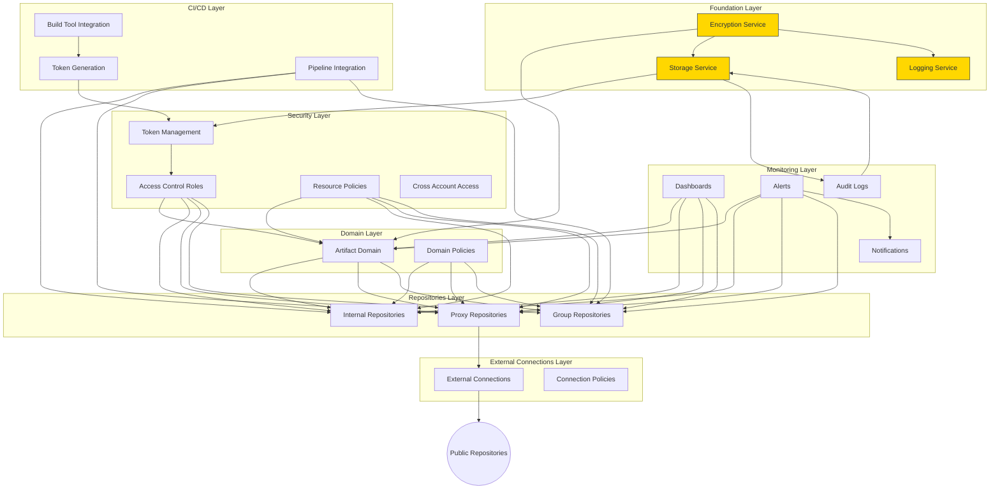

# AWS CodeArtifact Architecture

This document describes the AWS architecture implemented by the terraform-aws-codeartifact module, focusing on the foundation layer and its relationship to the overall architecture.

## Architecture Overview

The terraform-aws-codeartifact solution follows a layered architecture approach, with each layer building upon the previous one to provide a complete artifact management system.

## Foundation Layer

The Foundation Layer establishes the core infrastructure that enables secure, compliant, and reliable artifact management. This layer provides the essential services upon which all other components rely.

### Key Components

#### Encryption Service

The encryption service secures sensitive data throughout the artifact management system:

* **Capabilities**:
  * Data encryption at rest for all artifacts
  * Secure key rotation
  * Granular access control to encryption operations
  * Customizable security policies

* **Use Cases**:
  * **Regulatory Compliance**: Ensures artifacts meet encryption requirements for regulated industries
  * **Intellectual Property Protection**: Safeguards proprietary code and binary artifacts
  * **Cross-Team Security**: Maintains security boundaries between different teams' artifacts
  * **Security Audit Support**: Provides encryption evidence for security audits

#### Storage Service

The storage service provides reliable, versioned storage for artifacts and system operations:

* **Capabilities**:
  * Versioned storage with tamper protection
  * Public access protection
  * Configurable access policies
  * Integration with encryption service

* **Use Cases**:
  * **Artifact Migration**: Staging area during migration from legacy artifact systems
  * **Artifact Backup**: Long-term backup storage for critical artifacts
  * **Audit Trail Storage**: Preserves access logs and system events for compliance
  * **Cross-Environment Promotion**: Temporary storage during artifact promotion processes

#### Logging Service

The logging service captures operational and audit events across the artifact management system:

* **Capabilities**:
  * Configurable retention periods for different types of logs
  * Encrypted log storage
  * Centralized logging for all artifact operations
  * Customizable log groups for different use cases

* **Use Cases**:
  * **Security Monitoring**: Track access patterns and detect unusual activity
  * **Operational Troubleshooting**: Debug issues with artifact retrieval or publishing
  * **Compliance Reporting**: Generate activity reports for compliance requirements
  * **Usage Analytics**: Analyze artifact consumption and publishing patterns

### Foundation Use Cases

The foundation layer directly supports the following key use cases:

#### Legacy Artifact Migration

When migrating from existing artifact repositories:

1. **Process Flow**:
   * Artifacts are exported from legacy systems
   * Intermediate storage securely holds artifacts during migration
   * Integrity verification ensures no corruption during transfer
   * Encryption services secure artifacts during and after migration
   * Logging services track the migration process for audit purposes

2. **Benefits**:
   * Secure transfer pathway for sensitive artifacts
   * Complete audit trail of migration activities
   * Versioned storage preserves artifact history
   * Data protection during transition period

#### Access Auditing and Compliance

For security teams requiring visibility into artifact usage:

1. **Process Flow**:
   * All artifact access generates log entries
   * Logs are stored with configurable retention periods
   * Encryption services protect sensitive log data
   * Storage services maintain immutable audit trails

2. **Benefits**:
   * Meet regulatory requirements for access tracking
   * Provide evidence for security audits
   * Enable investigation of security incidents
   * Support data governance initiatives

#### Secure Cross-Environment Promotion

When promoting artifacts between environments (dev→staging→prod):

1. **Process Flow**:
   * Source artifacts are securely stored with version control
   * Promotion processes use encrypted transfer channels
   * All promotion activities generate audit logs
   * Destination environments verify artifact integrity

2. **Benefits**:
   * Maintain artifact integrity across environments
   * Prevent unauthorized modifications during promotion
   * Create audit trail of promotion activities
   * Support compliance requirements for production releases

### Integration with Other Layers

The foundation layer provides essential services to other layers in the architecture:

1. **Domain Layer Integration**:
   * Encryption services secure the domain and its artifacts
   * Logging captures domain-level operations
   * Storage supports domain backup and recovery

2. **Repositories Layer Integration**:
   * Encryption secures repository contents
   * Logging tracks repository access and modifications
   * Storage supports repository migration and backup

3. **Security Layer Integration**:
   * Encryption supports access token security
   * Logging captures authentication and authorization events
   * Storage maintains security policy backups

4. **Monitoring Layer Integration**:
   * Logging provides data for operational dashboards
   * Storage maintains historical monitoring data
   * Encryption protects sensitive monitoring information

## Implementation Flexibility

The foundation layer is designed for flexibility to accommodate various organizational needs:

1. **Component Modularity**:
   * Each service (encryption, storage, logging) can be enabled or disabled independently
   * Services can be configured based on specific requirements
   * Default configurations follow best practices but can be customized

2. **Security Customization**:
   * Default security policies can be extended or replaced
   * Access controls can be tailored to organizational structure
   * Encryption settings can meet specific regulatory requirements

3. **Operational Adjustments**:
   * Log retention can be configured based on compliance needs
   * Storage policies can be optimized for cost or performance
   * Resource naming can follow organizational conventions

## Security Considerations

The foundation layer implements several security best practices:

1. **Data Protection**:
   * All sensitive data is encrypted at rest
   * Public access to storage resources is blocked by default
   * Encryption keys follow rotation best practices

2. **Access Control**:
   * Least-privilege principle applied to all services
   * Resource policies limit access to authorized services
   * Separation of duties enforced through role-based access

3. **Audit Capabilities**:
   * Comprehensive logging of all management operations
   * Configurable log retention for compliance requirements
   * Immutable audit trails for security investigations

## Cost Optimization

The foundation layer includes features to manage costs effectively:

1. **Resource Efficiency**:
   * Configurable log retention to balance compliance and cost
   * Storage lifecycle policies to manage artifact storage costs
   * Ability to disable unused components to avoid unnecessary charges

2. **Operational Savings**:
   * Automation reduces manual management overhead
   * Centralized services reduce duplicate implementations
   * Best practices reduce security incident remediation costs

## Conclusion

The foundation layer provides the essential infrastructure for secure, compliant, and reliable artifact management. By implementing encryption, storage, and logging services, it establishes a solid base for the entire CodeArtifact architecture, enabling organizations to manage their software artifacts effectively while meeting security and compliance requirements.
