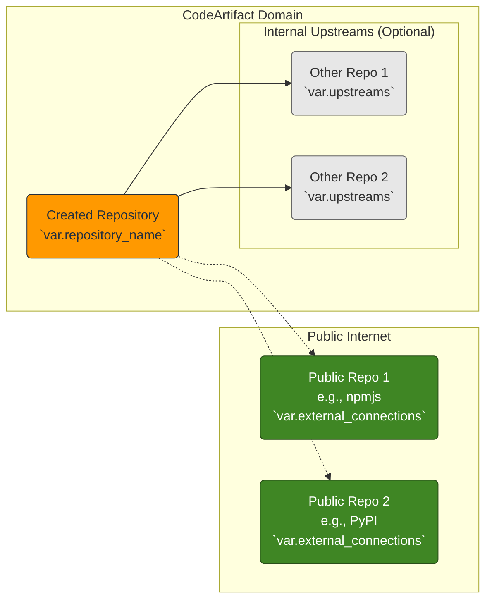

# Terraform AWS CodeArtifact Repository Module: Architecture

## 1. Introduction

This document outlines the architecture, resources, configuration options, and use cases for the `repository` Terraform module. This module is designed to provision and manage AWS CodeArtifact repositories within a specified CodeArtifact domain.

## 2. Architectural Context

This module focuses on creating the **Repository** resource within the broader AWS CodeArtifact service structure. A Repository exists within a **Domain** and contains **Packages**, which in turn have **Versions** and **Assets**.

```mermaid
graph TD
    subgraph "AWS CodeArtifact Hierarchy"
        D[Domain<br>`var.domain_name`] --> R("Repository<br><b>(Created by this Module)</b>");
        R --> P[Package<br>(e.g., my-library)];
        P --> V[Package Version<br>(e.g., 1.0.0)];
        V --> A1[Asset<br>(e.g., my-library-1.0.0.jar)];
        V --> A2[Asset<br>(e.g., my-library-1.0.0.pom)];
    end

    style D fill:#FFD700,stroke:#333;
    style R fill:#FF9900,stroke:#232F3E,color:#232F3E;
    style P fill:#ADD8E6,stroke:#333;
    style V fill:#ADD8E6,stroke:#333;
    style A1 fill:#E7E7E7,stroke:#666;
    style A2 fill:#E7E7E7,stroke:#666;
```

This module requires the parent `Domain` to exist and takes its name (`var.domain_name`) as input. It then provisions the `Repository` and optionally its permissions policy. Management of packages, versions, and assets occurs *outside* this module, typically via package manager clients (npm, mvn, pip, etc.) interacting with the repository endpoint.

## 3. Use Cases

This module supports several common CodeArtifact repository patterns:

*   **Basic Hosted Repository (Normal):**
    *   **Description:** Creates a standard CodeArtifact repository (without upstreams) primarily intended for storing packages published directly from your build processes.
    *   **Configuration:** Set `var.upstreams = null` and `var.external_connections = null`.
    *   **Applicability:** Storing internal libraries, applications, or artifacts specific to your organization.

*   **Internal Proxy Repository (Upstream):**
    *   **Description:** Creates a repository that acts as a proxy (via `upstreams`) for *other* CodeArtifact repositories within the *same domain*. Developers can use this single repository endpoint to access packages from multiple internal upstream sources.
    *   **Configuration:** Provide a list of existing repository names within the domain to `var.upstreams`. Set `var.external_connections = null`.
    *   **Applicability:** Centralizing access to packages from different teams or projects within your organization, simplifying dependency management for developers.

*   **Public Proxy Repository (External Connection):**
    *   **Description:** Creates a repository that connects to public package repositories (like npmjs, PyPI, Maven Central, etc.) via `external_connections`. CodeArtifact fetches and caches packages from these public sources on demand.
    *   **Configuration:** Provide a list of valid external connection strings (e.g., `"public:npmjs"`) to `var.external_connections`. Set `var.upstreams = null`.
    *   **Applicability:** Managing and caching dependencies from public sources, potentially applying security controls or ensuring availability even if the public source is down.

*   **Combined Proxy Repository (Upstream + External):**
    *   **Description:** Creates a repository that combines both internal `upstreams` and `external_connections`. This provides a single endpoint for developers to resolve dependencies from both internal CodeArtifact repositories and public sources.
    *   **Configuration:** Configure both `var.upstreams` and `var.external_connections`.
    *   **Applicability:** Providing a unified view of all available packages, both internal and public, simplifying developer configuration.

*   **Repository with Custom Permissions:**
    *   **Description:** Creates a repository and attaches a specific resource-based policy to control access in a granular way, beyond standard IAM role permissions.
    *   **Configuration:** Provide a valid JSON policy document string to `var.repository_policy_document`.
    *   **Applicability:** Implementing fine-grained access control, restricting specific actions (like publishing or deleting) to certain principals, or enabling cross-account access to the repository.

## 3. Module Resources

This module conditionally creates the following AWS resources based on the input variables:

```mermaid
graph TD
    subgraph "Module: repository"
        direction LR
        Input[Input Variables] --> Logic{Local Logic};

        subgraph "Conditional Resources"
            Logic -- "local.create_repository (var.is_enabled)" --> R(aws_codeartifact_repository.this);
            Logic -- "local.create_policy (var.is_enabled && var.repository_policy_document != null)" --> P(aws_codeartifact_repository_permissions_policy.this);
            R --> P; // Dependency shown by arrow
            end
        end

        R --> OutputR[Outputs: ARN, Name, etc.];
        P --> OutputP[Outputs: Policy Revision];
    end

    style R fill:#FF9900,stroke:#232F3E,color:#232F3E
    style P fill:#FF9900,stroke:#232F3E,color:#232F3E
    style Input fill:#C9C9C9,stroke:#333
    style Logic fill:#C9C9C9,stroke:#333
    style OutputR fill:#C9C9C9,stroke:#333
    style OutputP fill:#C9C9C9,stroke:#333
```

*   **`aws_codeartifact_repository` (`this`):**
    *   The core CodeArtifact repository resource.
    *   Created only if `var.is_enabled` is `true`.
    *   Configured with the provided `domain_name`, `repository_name`, `description`, `tags`.
    *   Dynamically includes `upstreams` blocks based on `var.upstreams`.
    *   Dynamically includes `external_connections` blocks based on `var.external_connections`.

*   **`aws_codeartifact_repository_permissions_policy` (`this`):**
    *   Attaches a resource-based policy to the repository.
    *   Created only if `var.is_enabled` is `true` AND `var.repository_policy_document` is provided (not `null`).
    *   Depends on the successful creation of the `aws_codeartifact_repository.this` resource.

## 4. Configuration Options

Key input variables controlling the module's behavior:

*   `is_enabled` (bool, default: `true`): Master switch to enable/disable resource creation.
*   `domain_name` (string, **required**): The target CodeArtifact domain name.
*   `repository_name` (string, **required**): The desired name for the repository.
*   `description` (string, optional): Optional description for the repository.
*   `upstreams` (list(object), optional): List of internal upstream repositories. See Use Cases.
*   `external_connections` (list(string), optional): List of public repository connections. See Use Cases.
*   `repository_policy_document` (string, optional): JSON policy document for resource-based permissions.
*   `tags` (map(string), optional): Tags to apply to the repository resource.

*(Refer to `variables.tf` or the generated `README.md` for the full list and detailed descriptions.)*

## 5. Connectivity: Upstreams and External Connections

CodeArtifact repositories can retrieve packages from other repositories. This module configures these relationships via `var.upstreams` and `var.external_connections`.



*   **Upstreams (`var.upstreams`):** Define connections to *other repositories within the same CodeArtifact domain*. When a package manager requests a package from `Repo` that isn't present, CodeArtifact checks the specified upstream repositories (`Upstream1`, `Upstream2`).
*   **External Connections (`var.external_connections`):** Define connections to *well-known public repositories* (e.g., `public:npmjs`, `public:pypi`). When a package isn't found in `Repo` or its internal `upstreams`, CodeArtifact can fetch it from these public sources via the configured connections.

## 7. Permissions

*   **IAM Permissions:** Access to CodeArtifact repositories (reading, publishing) is primarily controlled via standard AWS IAM roles and policies attached to users or compute resources (e.g., EC2 instances, Lambda functions, CodeBuild projects). These IAM policies are managed *outside* this specific module (likely in a dedicated security module).
*   **Repository Policy (`var.repository_policy_document`):** This module allows attaching an *additional* resource-based policy directly to the repository itself. This is useful for:
    *   Granting cross-account access.
    *   Defining fine-grained permissions that are tied directly to the repository resource.
    *   Simplifying permissions when IAM roles are complex or managed separately.
    *   This policy is evaluated alongside IAM policies. Access is granted if *either* the IAM policy *or* the repository policy allows it (unless explicitly denied).
